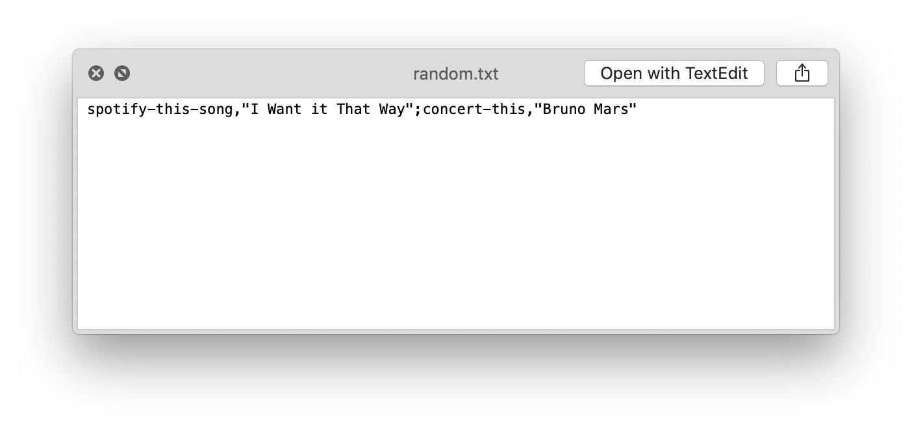
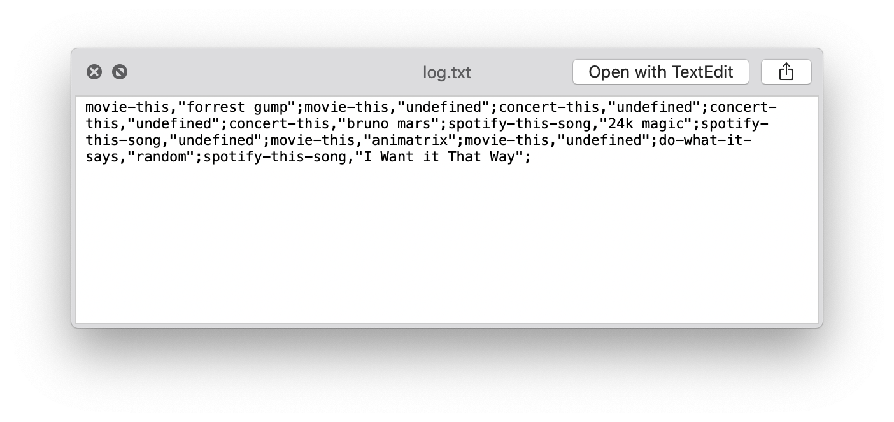

# LIRI Bot

### Overview
 LIRI is like iPhone's SIRI. However, while SIRI is a Speech Interpretation and Recognition Interface, LIRI is a _Language_ Interpretation and Recognition Interface. LIRI will be a command line node app that takes in parameters and gives you back data.

 ### Commands

*`node liri.js concert-this <artist/band name here>`* 
	This will search the Bands in Town Artist Events API and provide the `Venue name`, `Venue location`, and `Date of the Event`

*`node liri.js spotify-this-song '<song name here>'`* 
	This will show the following information about the song using the Spotify API.  It will display a list of albums with that song title, displaying `artist(s)`, `title`, `album name`, and `preview URL`

*`node liri.js movie-this '<movie name here>'`* 
	This will output information about the movie using the OMDB API.  The following information will be displayed:
	* Title of the movie.
       * Year the movie came out.
       * IMDB Rating of the movie.
       * Rotten Tomatoes Rating of the movie.
       * Country where the movie was produced.
       * Language of the movie.
       * Plot of the movie.
       * Actors in the movie.

*`node liri.js do-what-it-says`* 
	This runs a random command that is stored on the `random.txt` file

 
##### The Random File:

### BONUS
The file `log.txt` will contain a list of each command that was ran.
##### The Log File: 

